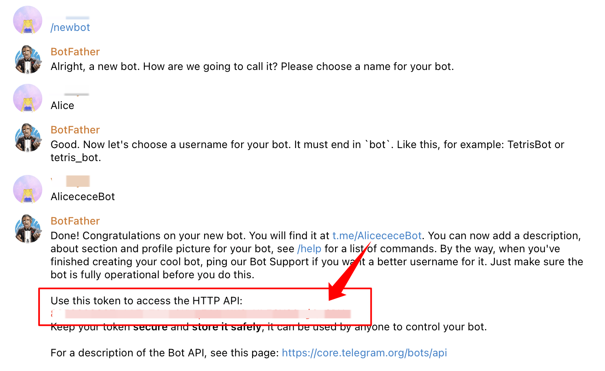
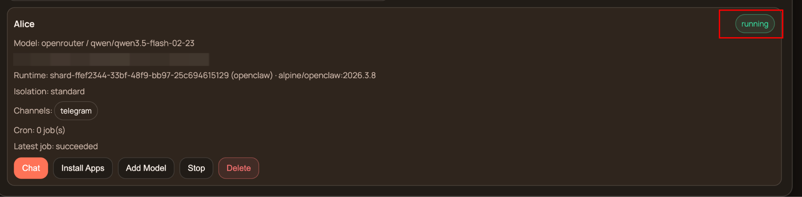
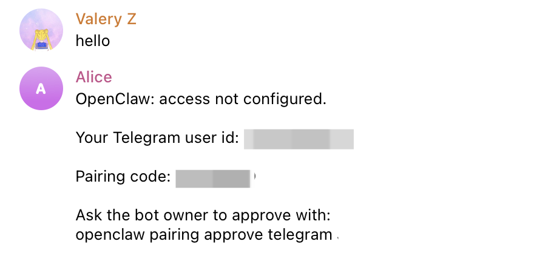
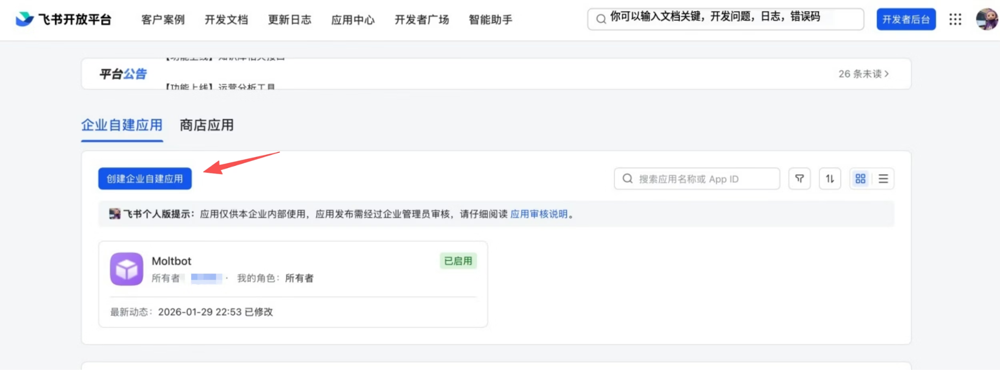
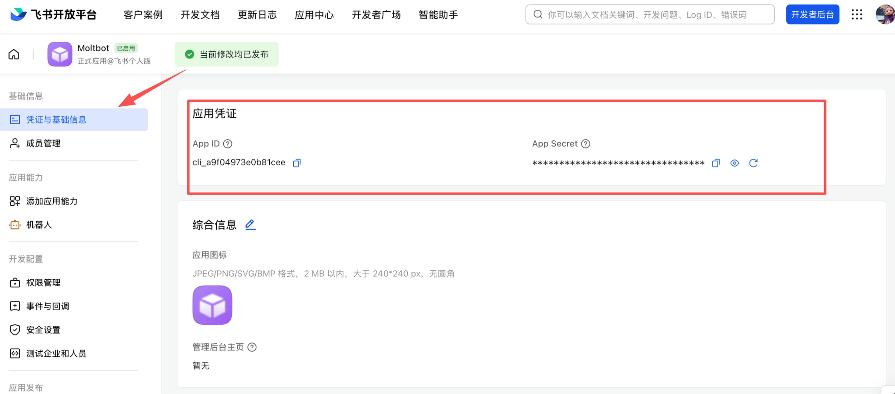
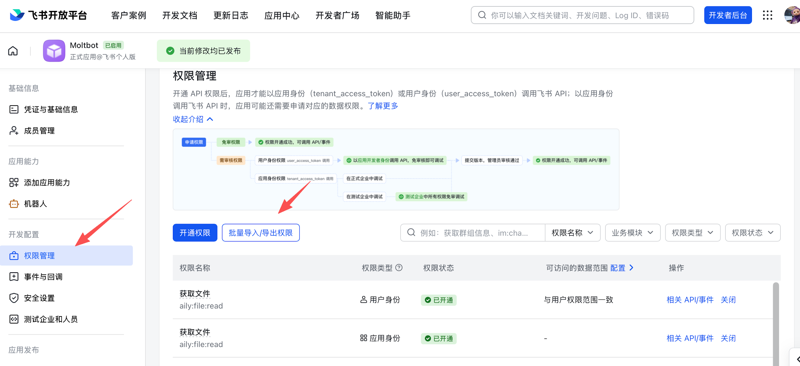
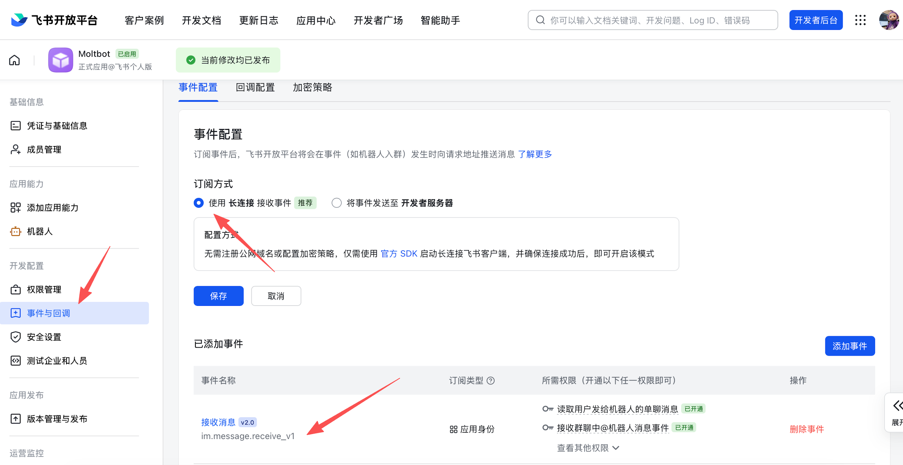
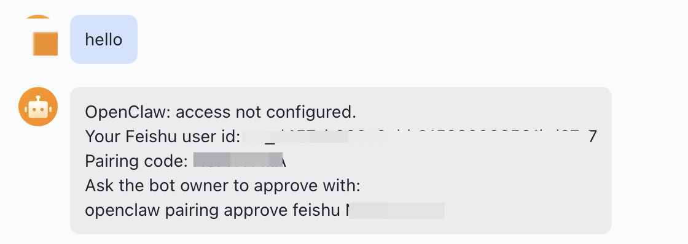

# Connect Channel

This guide walks you through connecting Telegram and Feishu to your Claw on ClawUp. After completing these steps, your AI assistant will be able to receive and reply to messages on the connected platform.

---

## Part 1: Connect Telegram

### Step 1: Create a Telegram Bot

1. Open Telegram and search for **@BotFather**
2. Start a chat with BotFather and send the command: `/newbot`
3. BotFather will ask you for a **name** for your bot — this is the display name (e.g., "My Assistant")
4. Then it will ask for a **username** — this must end in "bot" (e.g., `TetrisBot` or `tetris_bot`)
5. Once created, BotFather will send you a message containing your **Bot Token** — it looks like this:
   ```
   8715939390:AAETud7eTEvYpWN2Z55_XXXXXXXXX
   ```
6. Copy this token — you'll use it when creating your Claw on ClawUp

> ⚠️ **Keep your bot token secret.** Anyone with this token can control your bot.



### Step 2: Create Your Claw

1. On ClawUp, create a new Claw and check **Telegram** as the channel
2. Paste the Bot Token from BotFather
3. Click **Create Claw**

### Step 3: Wait for Deployment

After clicking Create Claw:

1. The status will show `creating` → `reconciling` → `running`
2. This usually takes 1–3 minutes
3. Once the status shows **running**, your Claw is live



### Step 4: Complete Telegram Pairing

Once your Claw is running, the Telegram bot needs to be paired:

1. Open Telegram and find your bot (search for the username you created)
2. Send any message to the bot (e.g., "hello")
3. The bot will reply with a pairing code, for example:
   > "Ask the bot owner to approve with: `openclaw pairing approve telegram XXXXXXX`"

   Copy the entire command.
4. Go back to ClawUp Dashboard → Overview → **Open Claw Chat**
5. Send the full pairing code to your Claw
6. Your Claw will reply: "Telegram has been approved". If your Claw does not indicate success, send this message:
   > Configure Telegram, run the command: `openclaw pairing approve telegram XXXXXX`
7. Go back to Telegram and send a message to your bot
8. The bot should reply — your Telegram channel is now connected! ✅



---

## Part 2: Connect Feishu

### Step 1: Create a Feishu Enterprise App

1. Go to the Feishu [Open Platform](https://open.feishu.cn/) and log in with your Feishu account
2. Click **Create App** → select **Custom App**
3. Fill in the app name and description
4. After creation, go to the app's settings page
5. Copy the **App ID** and **App Secret** — you'll use them when creating your Claw on ClawUp





### Step 2: Configure Permissions

On **Permissions**, click **Batch import** and paste:

```json
{
  "scopes": {
    "tenant": [
      "aily:file:read",
      "aily:file:write",
      "application:application.app_message_stats.overview:readonly",
      "application:application:self_manage",
      "application:bot.menu:write",
      "cardkit:card:read",
      "cardkit:card:write",
      "contact:user.employee_id:readonly",
      "corehr:file:download",
      "event:ip_list",
      "im:chat.access_event.bot_p2p_chat:read",
      "im:chat.members:bot_access",
      "im:message",
      "im:message.group_at_msg:readonly",
      "im:message.p2p_msg:readonly",
      "im:message:readonly",
      "im:message:send_as_bot",
      "im:resource"
    ],
    "user": [
      "aily:file:read",
      "aily:file:write",
      "im:chat.access_event.bot_p2p_chat:read"
    ]
  }
}
```



### Step 3: Enable Bot Capability

In **App Capability → Bot**:

1. Enable bot capability
2. Set the bot name

### Step 4: Configure Event Subscription

> ⚠️ Before configuring event subscription, make sure your Claw is already created and running on ClawUp. The WebSocket connection will not activate without an active backend.

In **Event Subscription**:

1. Choose **Use long connection to receive events (WebSocket)**
2. Add the event: `im.message.receive_v1`



### Step 5: Publish the App

1. Create a version in **Version Management & Release**
2. Submit for review and publish
3. You will receive a message in Feishu asking you to approve the app release. Please approve it

### Step 6: Complete Feishu Pairing

Once the Claw is running:

1. Open Feishu and find your bot (search for the bot name you set)
2. Send any message to the bot
3. The bot will reply with a pairing code. Copy the entire command
4. Go back to ClawUp Dashboard → Overview → **Open Claw Chat**
5. Send the full pairing code to your Claw
6. Your Claw will reply: "Feishu has been approved." If your Claw does not indicate success, send this message:
   > Configure Feishu, run the command: `openclaw pairing approve feishu XXXXXX`
7. Go back to Feishu and send a message to your bot
8. The bot should reply — your Feishu channel is now connected! ✅



---

## Troubleshooting

| Problem | Solution |
|---------|----------|
| Bot token invalid | Double-check the token from BotFather. No extra spaces. |
| Claw stuck on "creating" | Wait up to 5 minutes. If still stuck, try deleting and recreating. |
| No pairing code received | Make sure the Claw status is "running" before messaging the bot. |
| Pairing code expired | Send another message to the bot to get a new code. |
| Feishu events not working | Confirm event subscription is set to WebSocket mode and `im.message.receive_v1` is added. |
| Bot replies in Web Chat but not Telegram/Feishu | Channel pairing has not been completed. Continue chatting with your Claw to complete it. |

---

## Summary

**Telegram:**
1. @BotFather → `/newbot` → Get Bot Token
2. ClawUp → Create Claw → Check Telegram → Paste Token
3. Wait 1–3 min for "running" status
4. Message bot on Telegram → Get pairing code → Send to Claw
5. Verify: bot replies on Telegram ✅

**Feishu:**
1. Feishu Open Platform → Create App → Get App ID + App Secret
2. Enable Bot + Configure WebSocket Events
3. Publish App
4. ClawUp → Create Claw → Check Feishu → Paste Credentials
5. Message bot on Feishu → Get pairing code → Send to Claw
6. Verify: bot replies on Feishu ✅

**Need help?** Join our Telegram community [@clawup](https://t.me/clawup)
