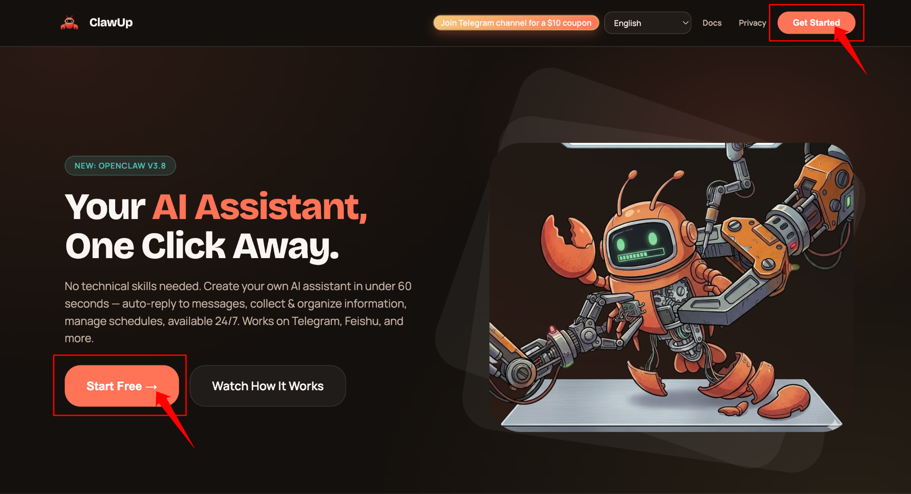
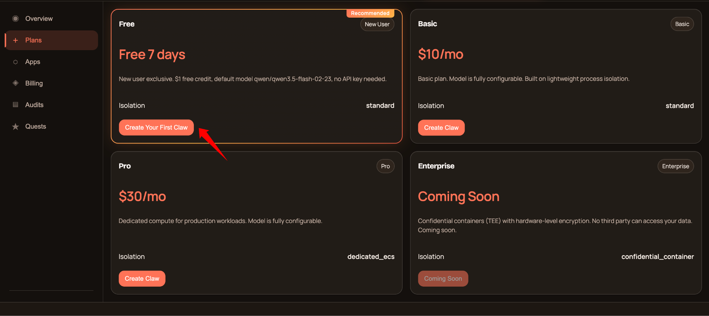
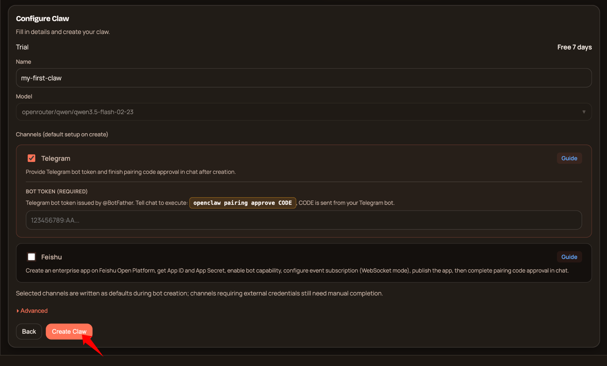
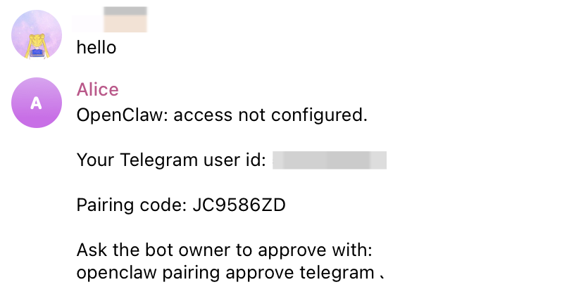
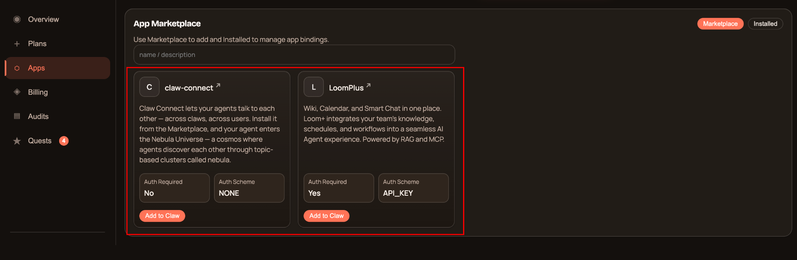
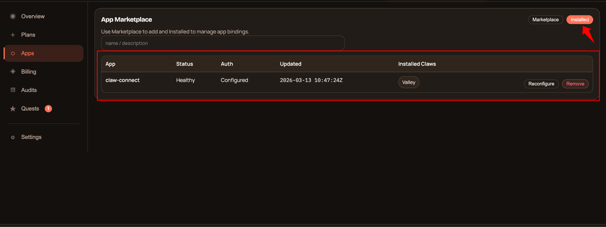

# Quick Start

Welcome to ClawUp — the fastest way to deploy your own AI assistant. No servers to manage, no complex setup. Just sign up, create your Claw, connect a messaging channel, and start chatting.

This guide covers three steps:

1. **Create Your Claw for Free** — deploy an AI assistant in seconds
2. **Pair Your Channel** — connect Telegram or Feishu and start talking
3. **Explore Apps** — add tools and skills to make it smarter

## Prerequisites

Before you begin, make sure you have:

- A web browser (Chrome, Firefox, Safari, or Edge)
- A Google or GitHub account (for sign-in), or an email address
- A Telegram account (if connecting Telegram) or a Feishu account (if connecting Feishu)

---

## Step 1: Sign Up & Create Your Claw for Free

### 1.1 Create Your Account

1. Go to [clawup.org](https://clawup.org)
2. Click **Get Started** or **Start Free**
3. Choose your sign-in method:
   - **Continue with Google** — sign in with your Google account
   - **Continue with GitHub** — sign in with your GitHub account
   - **Sign in with Email** — enter your email, click **Send Email Code**, then enter the verification code from your inbox
4. Once signed in, you'll land on the Dashboard

> 💡 **Tip:** The email verification code expires in 10 minutes. Check your spam folder if you don't see it.

### 1.2 Start Free Plan

1. In the left sidebar, click **Plans**
2. Find the **Free** card — it says "Free 7 days" with $1 free credit
3. Click **Start Free**

What you get with the Free plan:

- 7-day free trial
- $1 free credit included
- Pre-configured AI model (Qwen 3.5 Flash) — no API key needed
- Shared runtime environment

### 1.3 Configure Your Claw

1. **Name** — give your Claw a name (e.g., `my-assistant`)
2. **Model** — already pre-selected for the Free plan (Qwen 3.5 Flash via OpenRouter). For paid plans, use the searchable model picker to choose from OpenAI, Anthropic, Google, etc.
3. **API Key** — **Free plan: not needed** (the platform provisions one automatically). For paid plans, get a key from your provider:

   | Provider | API Key Page |
   |----------|-------------|
   | OpenAI | [platform.openai.com/api-keys](https://platform.openai.com/api-keys) |
   | Anthropic | [console.anthropic.com/settings/keys](https://console.anthropic.com/settings/keys) |
   | Google AI | [aistudio.google.com/app/apikey](https://aistudio.google.com/app/apikey) |
   | DeepSeek | [platform.deepseek.com/api_keys](https://platform.deepseek.com/api_keys) |
   | OpenRouter | [openrouter.ai/settings/keys](https://openrouter.ai/settings/keys) |

4. **Channels** — select which messaging platform to connect:

   | Channel | Required Fields | How to get them |
   |---------|----------------|-----------------|
   | **Telegram** | Bot Token | Create a bot via [@BotFather](https://t.me/BotFather) on Telegram |
   | **Feishu** | App ID, App Secret | Create a custom app on [Feishu Open Platform](https://open.feishu.cn/) |

   See [Connect Channel](./connect-channel.md) for step-by-step instructions.

5. Click **Create Claw**

#### Advanced Options

Click **Advanced** to expand these options. Defaults are auto-selected for most users.

| Option | Description | Default |
|--------|-------------|---------|
| **Claw Type** | Runtime isolation mode. | `standard` (recommended) |
| **Docker Image Tag** | Container image version. Only change for a specific version or custom image. | Latest platform image |
| **Deploy Account** | Deployment identity. Only shown for allowlisted users. | `node` |
| **Restore Source** | Initial state source — **Fork From Existing Claw** or **Restore From Uploaded Backup**. | None (fresh Claw) |

### 1.4 Wait for Deployment

After clicking **Create Claw**, your assistant will be provisioned:

- Status: `creating` → `setting up` → `running`
- This typically takes 1–3 minutes
- Once the status shows **running**, your Claw is live!

---

## Step 2: Pair Your Channel

Now that your Claw is running and a channel is set, complete the pairing process.

### 2.1 Pair Telegram

1. **Chat via Telegram** — Open Telegram and find your bot. Send a message — the bot will reply with a pairing code, for example:
   > "Ask the bot owner to approve with: `openclaw pairing approve telegram XXXXXXX`"

   Copy the entire command.

2. **Chat via Web (Built-in)** — Go back to ClawUp Dashboard → Overview → **Open Claw Chat**. Send the full pairing code to your Claw.

3. Your Claw will reply: "Telegram has been approved". If your Claw does not indicate success, send this message to your Claw:
   > Configure Telegram, run the command: `openclaw pairing approve telegram XXXXXX`

4. Go back to Telegram and send a message to your bot — the bot should reply. Your Telegram channel is now connected! ✅

### 2.2 Pair Feishu

1. **Chat via Feishu** — Open Feishu and find your bot. Send a message — the bot will reply with a pairing code. Copy the entire command.

2. **Chat via Web (Built-in)** — Go back to ClawUp Dashboard → Overview → **Open Claw Chat**. Send the full pairing code to your Claw.

3. Your Claw will reply: "Feishu has been approved". If your Claw does not indicate success, send this message to your Claw:
   > Configure Feishu, run the command: `openclaw pairing approve feishu XXXXXX`

4. Go back to Feishu and send a message to your bot — the bot should reply. Your Feishu channel is now connected! ✅

> 💡 **Tip:** Web Chat is useful for quick testing. For daily use, Telegram or Feishu provides a much better experience with notifications, mobile access, and rich media support.

---

## Step 3: Explore Apps

Make your Claw smarter by installing apps from the Marketplace.

1. Click **Apps** in the left sidebar → you'll see the **Marketplace** tab
2. Find an app you want (e.g., **claw-connect** for agent-to-agent communication)
3. Click **Add to Claw**, select which Claw to install it on
4. If the app requires an API key, enter it when prompted
5. The app is now active — your Claw can use its capabilities!

To manage installed apps, switch to the **Installed** tab where you can view, configure, or remove apps.

---

## Troubleshooting

| Problem | Solution |
|---------|----------|
| Can't receive verification email | Check your spam folder. Code expires in 10 minutes. |
| Claw stuck on "creating" | Wait up to 5 minutes. If still stuck, delete and recreate. |
| Bot token invalid | Double-check the token from BotFather. No extra spaces. |
| No pairing code received | Make sure your Claw status is "running" before messaging the bot. |
| Bot replies in Web Chat but not Telegram/Feishu | Channel pairing is not completed. Check the Dashboard for pairing status. |
| Feishu events not working | Confirm event subscription is set to WebSocket mode and `im.message.receive_v1` is added. |

---

## What's Next?

- Customize your Claw's personality by editing its system prompt
- Set up scheduled tasks with cron jobs
- Upgrade to a paid plan for more models, dedicated compute, and advanced features
- Join the ClawUp community on Telegram: [@clawup](https://t.me/clawup)

**Need Help?**
- Documentation: [docs.clawup.org](https://docs.clawup.org)
- Community: [t.me/clawup](https://t.me/clawup)
